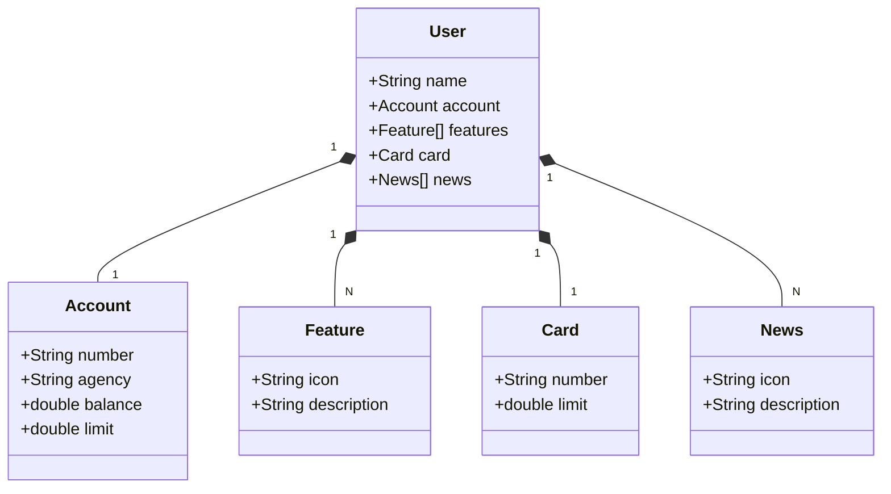

# DIO - Desafio API REST na Nuvem
Repositório para armazenar os arquivos do desafio do bootcamp de desenvolvimento Java com IA da plataforma DIO. O desafio consiste em desenvolver uma aplicação de um banco digital em Java (versão 17) utilizando o Spring Boot 3 e realizar o seu deploy através do Railway e PostgreeSQL.

## Diagrama de Classes

